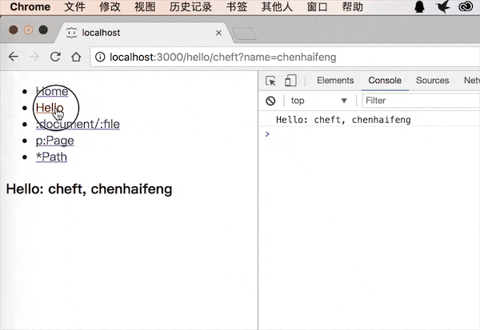

# minrouter
a micro middleware router that can be used in both client-side (e.g. dot.js, vue, react, preact) and server-side applications (e.g. Node.js/Express, Koa)

## features
* support koa
* support express
* support browser pushState & replaceState 
* middleware router, API like express

## preview


## install

    npm install minrouter

## build
    
    npm run build

## run demo

```shell
# build the web code
npm run demo

# http://localhost:3000
npm run express

or

# http://localhost:4000
npm run koa

or

# http://localhost:4000
npm run preact
 ```

## usage
> see demo directory code

## api
* Router.get(path, fn)
* Router.addResMethod(name, fn)
* Router.go(path, isReplace) __only browser__
* Router.back() __only browser__
* Router.proxyLinks(nodes) __only browser__
* req.query & req.params, this.ctx, this.ctx.res


> see src/minrouter.js
